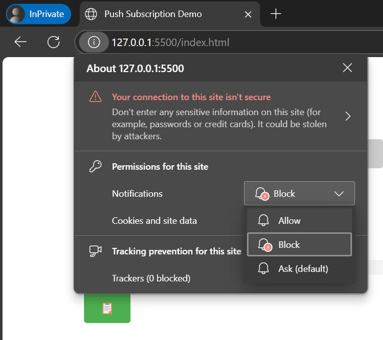
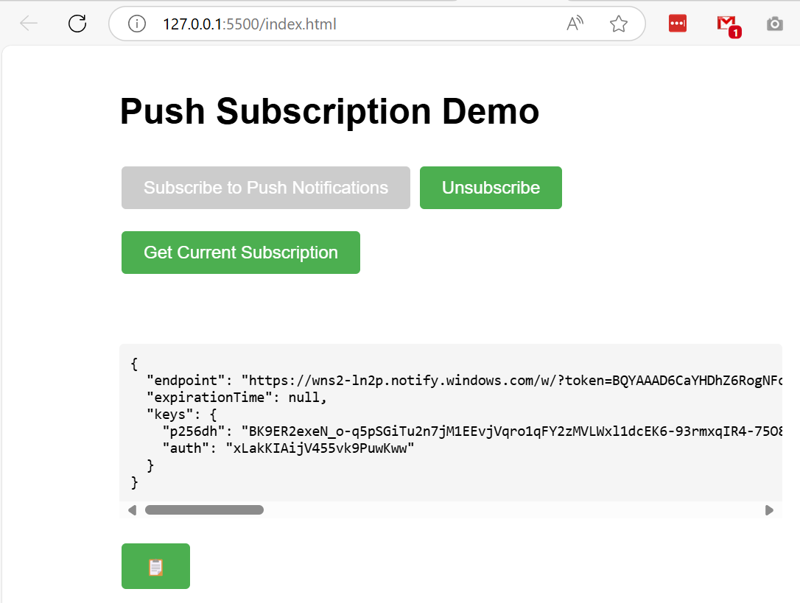

# push

1. 在本機新建目錄 `c:\Repository\push` 後，執行 git init 指令，接著做 git pull 下載 repo 到本機環境

   ```
   git remote add origin https://github.com/kevintan1983/push.git
   git pull origin main
   ```
2. 執行 npm install 指令安裝 package.json 裡的套件

   ```
   c:\Repository\push\npm install
   ```
3. 新增 **vapidKeys.json** 檔案，透過 [Vapid Key Generator | VapidKeys.com](https://vapidkeys.com/) 網站產生一組 Vapid Key，將 json 內容複製到 vapidKeys.json 檔案
4. VS Code 安裝 Live Server extension，將 index.html 按右鍵選 `Open With Live Server`
5. 瀏覽 http://127.0.0.1:5500/index.html，點選 Subscribe to Push Notifications 按鈕
   
6. grant permission (無痕模式不支援 Push API)
   
7. 複製 pushSubscription 物件內容
   
8. 貼到 pushSubscription.json 檔案裡
9. 開啟 Terminal 視窗，執行推播指令

   ```
   node .\sendPush.js
   ```
